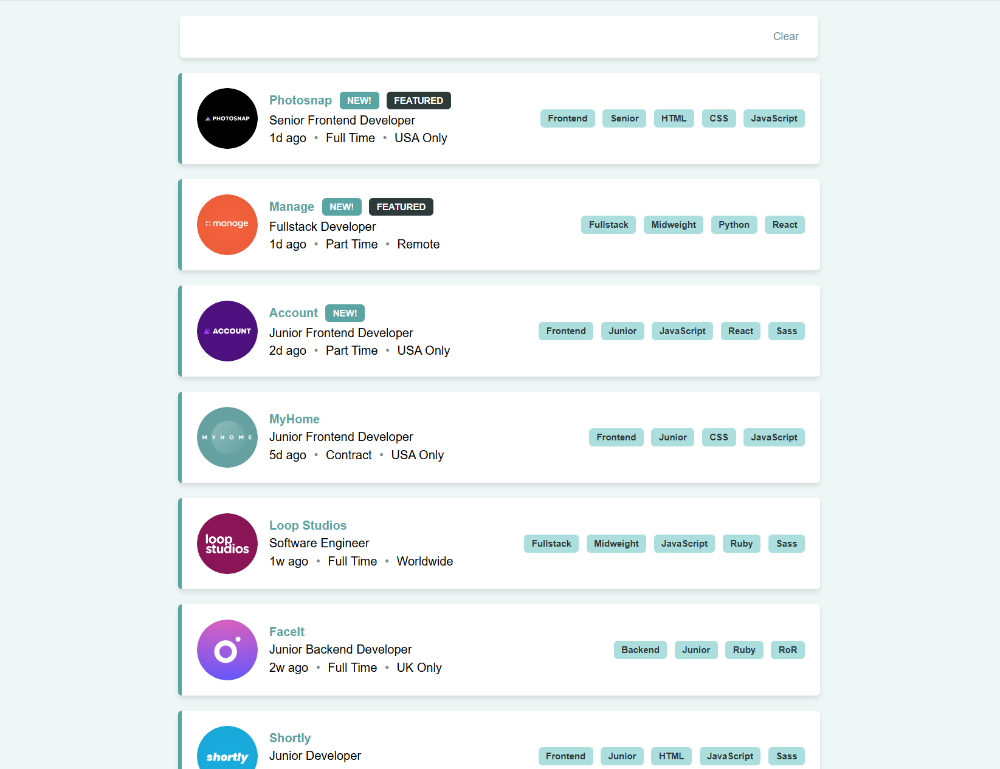
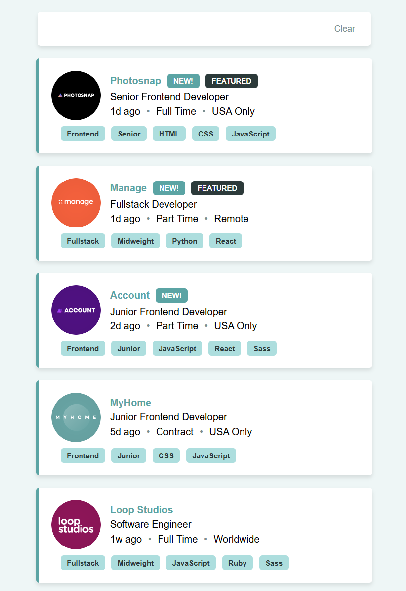

# Job Listings with Filtering

This is a React project that allows users to filter job listings based on various categories using a JSON data file.
Challenge project by Frontend Mentor.

## Features

- Display job listings from a JSON file.
- Filter job listings dynamically based on selected categories.
- Categories include:
  - **Role**: Frontend, Backend, Fullstack
  - **Level**: Junior, Midweight, Senior
  - **Languages**: Python, Ruby, JavaScript, HTML, CSS
  - **Tools**: React, Sass, Vue, Django, RoR (Ruby on Rails)
- Responsive design for various screen sizes.

## Technologies Used

- React
- TypeScript
- SCSS (Sass)
- JSON for data storage

## Screenshots




## Installation

1. Install dependencies:

   ```sh
   npm install
   ```

2. Start the development server:
   ```sh
   npm run dev
   ```
